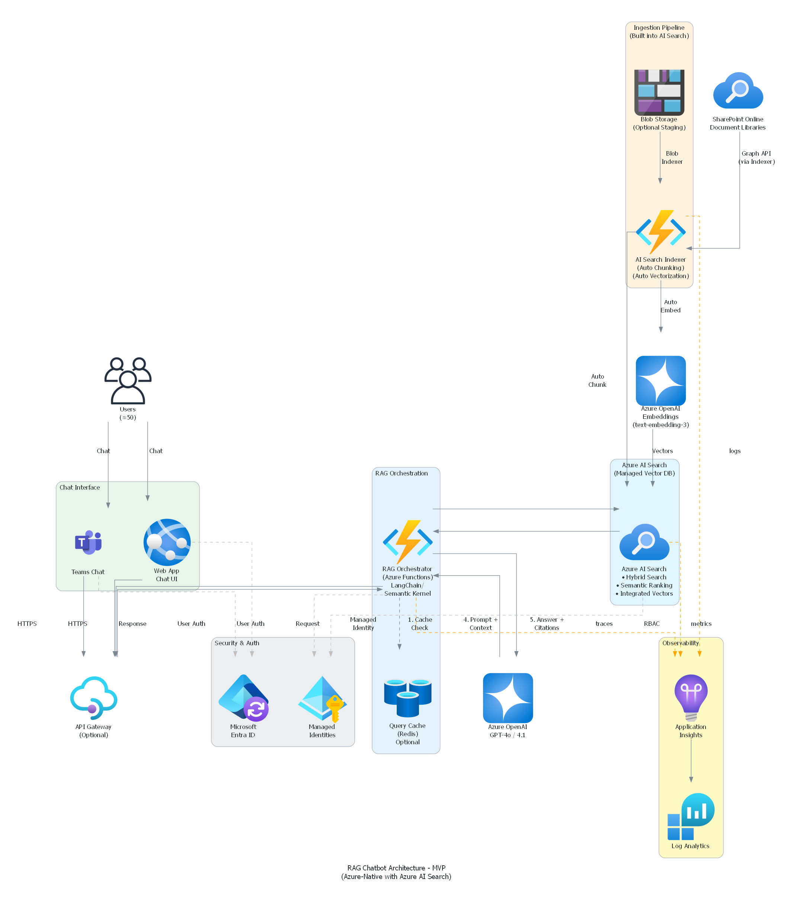

# RAG Chatbot POC - Project Requirements Document

> **Version:** 1.0  
> **Date:** January 29, 2026  
> **Status:** Draft  
> **Classification:** Internal

---

## Table of Contents

1. [Executive Summary](#1-executive-summary)
   - [1.5 Platform Comparison](#15-platform-comparison)
2. [Project Overview](#2-project-overview)
3. [Business Requirements](#3-business-requirements)
4. [Technical Architecture](#4-technical-architecture)
5. [Functional Requirements](#5-functional-requirements)
6. [Non-Functional Requirements](#6-non-functional-requirements)
7. [Infrastructure Requirements](#7-infrastructure-requirements)
8. [Security Requirements](#8-security-requirements)
9. [Data Requirements](#9-data-requirements)
10. [Integration Requirements](#10-integration-requirements)
11. [Development Requirements](#11-development-requirements)
12. [Testing & Evaluation](#12-testing--evaluation)
13. [Deployment Strategy](#13-deployment-strategy)
14. [Project Timeline](#14-project-timeline)
15. [Risk Assessment](#15-risk-assessment)
16. [Appendix](#16-appendix)

---

## 1. Executive Summary

### 1.1 Purpose

This document defines the requirements for building a **Retrieval-Augmented Generation (RAG) Chatbot** that enables employees to query organizational documents stored in SharePoint using natural language and receive accurate, citation-backed responses.

### 1.2 Problem Statement

Current chatbot solutions (e.g., Copilot Studio) provide responses that often **do not match source documents**, leading to:
- User distrust in AI-generated answers
- Increased support ticket volume
- Wasted time verifying information manually

### 1.3 Proposed Solution

A custom RAG architecture leveraging:
- **Azure AI Search** for hybrid search, semantic ranking, and integrated vectorization
- **Azure OpenAI** for embeddings and language generation
- **Azure Functions** for RAG orchestration (consumption-based)
- **Citation tracking** for transparency and trust

> **Note:** After evaluating Copilot Studio, Azure AI Foundry Prompt Flow, and custom code approaches, we selected the **custom code approach** with Azure AI Search for optimal cost, control, and repeatability. See [Section 1.5](#15-platform-comparison) for the full analysis.

### 1.4 Success Criteria

| Metric | Target | Measurement |
|--------|--------|-------------|
| Retrieval Accuracy | ≥85% | Correct source doc in top-3 results |
| Answer Relevance | ≥90% | LLM-as-judge evaluation |
| Faithfulness (Grounding) | ≥95% | Answer derived from retrieved context |
| Response Latency | <5 seconds | P95 response time |
| User Satisfaction | ≥4.0/5.0 | Post-interaction survey |

### 1.5 Platform Comparison

We evaluated three approaches to building this RAG chatbot:

#### Quick Comparison

| Approach | Time to MVP | Monthly Cost | Customization | Best For |
|----------|-------------|--------------|---------------|----------|
| **Copilot Studio** | 1-2 weeks | $2,000+ | Low | Non-developers |
| **Azure AI Foundry Prompt Flow** | 3-4 weeks | $400-800 | Medium | Data scientists |
| **Custom Code (Selected)** ✅ | 5-6 weeks | $400-600 | High | Developers |

#### Option 1: Microsoft Copilot Studio

| Pros | Cons |
|------|------|
| Build a working bot in hours | Limited customization of retrieval/ranking |
| No code required | No source control or CI/CD |
| 900+ Power Platform connectors | $30/user/mo for M365 Copilot license (tenant data access) |
| Built-in generative answers | Message-based pricing expensive at scale |
| Native Teams/SharePoint deployment | Limited Adaptive Cards formatting |

**Estimated Cost (50 users):** $2,000-2,300/month

#### Option 2: Azure AI Foundry Prompt Flow

| Pros | Cons |
|------|------|
| Visual DAG editor for prompt orchestration | Learning curve for DAG concepts |
| Built-in evaluation metrics | Managed endpoints incur always-on costs |
| Test multiple prompt variants | No streaming response support |
| Integrates with Azure ML pipelines | Must build chat UI separately |
| Easy model swapping | Portal-based development (not VS Code-native) |

**Estimated Cost:** $400-800/month

#### Option 3: Custom Code with Azure Functions + AI Search (Selected) ✅

| Pros | Cons |
|------|------|
| Full control over retrieval, prompts, logic | Longer initial development (5-6 weeks) |
| Standard DevOps (Git, CI/CD, unit tests) | Need Python/Node.js developers |
| Consumption-based pricing (lowest cost) | Must implement evaluation framework |
| Portable to other clouds | Must build chat UI separately |
| Easy for other teams to fork and deploy | You manage security and guardrails |

**Estimated Cost:** $400-600/month

#### Decision Rationale

We selected **Custom Code** because:

1. **Cost Efficiency:** ~$400-600/mo vs $2,000+/mo for Copilot Studio with licenses
2. **Full Control:** Tune hybrid search weights, semantic ranking, prompts
3. **Standard Practices:** Git, CI/CD, unit tests—our team already knows this
4. **Repeatability:** Other teams can fork the repo and deploy to their environments
5. **No Vendor Lock-in:** Standard Azure services, portable architecture

#### When to Reconsider

| Scenario | Consider Instead |
|----------|------------------|
| No developers available | → Copilot Studio |
| Need bot in < 1 week | → Copilot Studio |
| Data science team wants experimentation | → Prompt Flow |
| Already paying for M365 Copilot licenses | → Copilot Studio (marginal cost lower) |

---

## 2. Project Overview

### 2.1 Project Scope

#### In Scope
- Document Q&A over SharePoint document libraries
- Support for PDF, DOCX, PPTX, HTML file formats
- Teams and Web-based chat interfaces
- English language support
- ~50 concurrent users (POC phase)

#### Out of Scope (POC)
- Multi-language support
- Real-time document updates (<15 min delay acceptable)
- Voice/audio interfaces
- External document sources (OneDrive personal, external websites)

### 2.2 Stakeholders

| Role | Responsibility | Name |
|------|----------------|------|
| Executive Sponsor | Budget approval, strategic alignment | TBD |
| Product Owner | Requirements, prioritization | TBD |
| Project Manager | Timeline, resources, dependencies | TBD |
| Technical Lead | Architecture, implementation | TBD |
| AI/ML Engineer | RAG pipeline, evaluation | TBD |
| DevOps Engineer | Infrastructure, CI/CD | TBD |
| End Users | Testing, feedback | ~50 pilot users |

### 2.3 Assumptions

1. Azure subscription with sufficient quota for Azure OpenAI
2. SharePoint Online with Microsoft Graph API access
3. Users authenticated via Microsoft Entra ID
4. Documents are primarily in English
5. Existing IT infrastructure supports Azure services

### 2.4 Constraints

1. **Budget**: Azure AI Search Basic tier (~$75/mo) acceptable for MVP
2. **Timeline**: 6-week MVP delivery (simplified with managed services)
3. **Compliance**: Data must remain within organizational tenant
4. **Skills**: Limited DevOps expertise on team → Azure-native services preferred
5. **Repeatability**: Solution must be easy for other developers to replicate

---

## 3. Business Requirements

### 3.1 Business Objectives

| ID | Objective | Priority |
|----|-----------|----------|
| BO-1 | Reduce time employees spend searching for information | High |
| BO-2 | Improve accuracy of information retrieval vs. existing solutions | High |
| BO-3 | Provide verifiable sources for all answers | High |
| BO-4 | Minimize ongoing operational costs | Medium |
| BO-5 | Enable self-service for common questions | Medium |

### 3.2 User Stories

#### US-1: Document Query
> **As an** employee  
> **I want to** ask questions about company policies in natural language  
> **So that** I can quickly find accurate information without manual search

**Acceptance Criteria:**
- System returns relevant answer within 5 seconds
- Answer includes citations to source documents
- User can click citation to view original document

#### US-2: Multi-Document Synthesis
> **As an** employee  
> **I want to** get answers that synthesize information from multiple documents  
> **So that** I get a comprehensive response without reading multiple files

#### US-3: Confidence Indication
> **As an** employee  
> **I want to** know when the system is uncertain about an answer  
> **So that** I can seek human assistance when needed

#### US-4: Feedback Submission
> **As an** employee  
> **I want to** rate answers and provide feedback  
> **So that** the system can improve over time

---

## 4. Technical Architecture

### 4.1 Architecture Overview



> **Note:** We chose **Azure AI Search** over Weaviate for MVP because:
> - ✅ Fully managed (no Container Apps infrastructure)
> - ✅ Built-in hybrid search (vector + keyword)
> - ✅ Built-in semantic ranking (no custom reranker)
> - ✅ Integrated vectorization (auto chunking + embedding)
> - ✅ Native SharePoint indexer
> - ✅ Easy for developers to replicate

### 4.2 Component Summary

| Component | Technology | Purpose |
|-----------|------------|---------|
| **Chat Interface** | Teams Bot / Azure Web App | User interaction |
| **API Gateway** | Azure API Management (Optional) | Rate limiting, auth |
| **RAG Orchestrator** | Azure Functions (Python) | Query processing, prompt construction |
| **Vector + Hybrid Search** | **Azure AI Search (Basic)** | Hybrid search + semantic ranking |
| **Embeddings** | Azure OpenAI text-embedding-3-large | Text vectorization (via AI Search skill) |
| **LLM** | Azure OpenAI GPT-5-mini / GPT-5 | Response generation |
| **Cache** | Azure Cache for Redis (Optional) | Query caching for performance |
| **Document Source** | SharePoint Online | Knowledge base |
| **Ingestion** | **Azure AI Search Indexer** | Auto chunking + vectorization |
| **Observability** | Application Insights + Log Analytics | Monitoring, tracing |
| **Authentication** | Microsoft Entra ID | SSO, authorization |

### 4.3 Data Flow (Simplified with Azure AI Search)

```
┌─────────────────────────────────────────────────────────────────────────────┐
│                         QUERY FLOW (SIMPLIFIED)                              │
├─────────────────────────────────────────────────────────────────────────────┤
│                                                                              │
│  User ──► Teams/Web ──► API Gateway ──► RAG Orchestrator                    │
│                                              │                               │
│                                              ▼                               │
│                                    ┌─────────────────┐                       │
│                                    │  Azure AI Search │                      │
│                                    │  (Single Query)  │                      │
│                                    │                 │                       │
│                                    │  • Hybrid Search │  ◄── All in one!    │
│                                    │  • Semantic Rank │                      │
│                                    │  • Vector + BM25 │                      │
│                                    └────────┬────────┘                       │
│                                              │                               │
│                                              ▼                               │
│                                    Top-K Ranked Chunks                       │
│                                              │                               │
│                                              ▼                               │
│                                    ┌─────────────────┐                       │
│                                    │  Azure OpenAI   │                       │
│                                    │  GPT-4o         │                       │
│                                    │  (+ Citations)  │                       │
│                                    └────────┬────────┘                       │
│                                              │                               │
│                                              ▼                               │
│  User ◄─────────────────────────────── Response                             │
│                                                                              │
└─────────────────────────────────────────────────────────────────────────────┘
```

### 4.4 Ingestion Flow (Simplified - AI Search Handles Everything)

```
┌─────────────────────────────────────────────────────────────────────────────┐
│                    INGESTION FLOW (AZURE AI SEARCH)                          │
├─────────────────────────────────────────────────────────────────────────────┤
│                                                                              │
│  ┌──────────────┐                                                            │
│  │  SharePoint  │──────┐                                                     │
│  │  Documents   │      │                                                     │
│  └──────────────┘      │                                                     │
│                        ▼                                                     │
│  ┌──────────────┐   ┌─────────────────────────────────────────────┐         │
│  │ Blob Storage │──►│         Azure AI Search Indexer             │         │
│  │  (Optional)  │   │                                             │         │
│  └──────────────┘   │  ┌─────────────┐   ┌──────────────────┐    │         │
│                     │  │ Text Split  │──►│ Azure OpenAI     │    │         │
│                     │  │ Skill       │   │ Embedding Skill  │    │         │
│                     │  │ (Chunking)  │   │ (Vectorization)  │    │         │
│                     │  └─────────────┘   └────────┬─────────┘    │         │
│                     │                             │              │         │
│                     │              ┌──────────────┴──────────────┐│         │
│                     │              ▼                             ▼│         │
│                     │     Vector Index              Keyword Index ││         │
│                     │     (Embeddings)              (Full-Text)   ││         │
│                     └─────────────────────────────────────────────┘│         │
│                                                                              │
│  💡 No custom code needed! Configure via Azure Portal wizard.               │
│                                                                              │
└─────────────────────────────────────────────────────────────────────────────┘
```

---

## 5. Functional Requirements

### 5.1 Chat Interface

| ID | Requirement | Priority | Status |
|----|-------------|----------|--------|
| FR-1.1 | Support Microsoft Teams chat integration | High | Planned |
| FR-1.2 | Support web-based chat UI | High | Planned |
| FR-1.3 | Display markdown-formatted responses | Medium | Planned |
| FR-1.4 | Show typing indicators during processing | Low | Planned |
| FR-1.5 | Support conversation history (session-based) | Medium | Planned |

### 5.2 Query Processing

| ID | Requirement | Priority | Status |
|----|-------------|----------|--------|
| FR-2.1 | Accept natural language queries | High | Planned |
| FR-2.2 | Detect query intent (question, command, clarification) | Medium | Planned |
| FR-2.3 | Generate multiple query variations for improved recall | Medium | Planned |
| FR-2.4 | Handle follow-up questions with context | Medium | Planned |
| FR-2.5 | Support metadata filters (date, department, doc type) | Low | Planned |

### 5.3 Retrieval

| ID | Requirement | Priority | Status |
|----|-------------|----------|--------|
| FR-3.1 | Perform vector similarity search | High | Planned |
| FR-3.2 | Perform keyword (BM25) search | High | Planned |
| FR-3.3 | Combine results using Reciprocal Rank Fusion | High | Planned |
| FR-3.4 | Rerank results using cross-encoder | High | Planned |
| FR-3.5 | Return top-K chunks with relevance scores | High | Planned |
| FR-3.6 | Cache semantically similar queries | Medium | Planned |

### 5.4 Response Generation

| ID | Requirement | Priority | Status |
|----|-------------|----------|--------|
| FR-4.1 | Generate answers grounded in retrieved context | High | Planned |
| FR-4.2 | Include inline citations [1], [2], etc. | High | Planned |
| FR-4.3 | Provide source document links | High | Planned |
| FR-4.4 | Indicate uncertainty when context is insufficient | High | Planned |
| FR-4.5 | Apply content safety filters | High | Planned |

### 5.5 Document Ingestion

| ID | Requirement | Priority | Status |
|----|-------------|----------|--------|
| FR-5.1 | Ingest documents from SharePoint via Graph API | High | Planned |
| FR-5.2 | Support PDF, DOCX, PPTX, HTML formats | High | Planned |
| FR-5.3 | Extract text while preserving structure | High | Planned |
| FR-5.4 | Chunk documents semantically | High | Planned |
| FR-5.5 | Attach metadata (title, URL, date, department) | High | Planned |
| FR-5.6 | Support incremental/delta sync | Medium | Planned |
| FR-5.7 | Handle document deletions/updates | Medium | Planned |

### 5.6 Feedback & Evaluation

| ID | Requirement | Priority | Status |
|----|-------------|----------|--------|
| FR-6.1 | Collect thumbs up/down feedback | High | Planned |
| FR-6.2 | Allow users to report incorrect answers | Medium | Planned |
| FR-6.3 | Log all queries, retrievals, and responses | High | Planned |
| FR-6.4 | Calculate retrieval metrics (precision, recall) | High | Planned |
| FR-6.5 | Calculate generation metrics (faithfulness, relevance) | High | Planned |

---

## 6. Non-Functional Requirements

### 6.1 Performance

| ID | Requirement | Target | Priority |
|----|-------------|--------|----------|
| NFR-1.1 | Response latency (P50) | <3 seconds | High |
| NFR-1.2 | Response latency (P95) | <5 seconds | High |
| NFR-1.3 | Ingestion throughput | 100 docs/hour | Medium |
| NFR-1.4 | Concurrent users | 50 | High |
| NFR-1.5 | Cache hit rate | >30% | Medium |

### 6.2 Availability

| ID | Requirement | Target | Priority |
|----|-------------|--------|----------|
| NFR-2.1 | System availability (POC) | 99% | Medium |
| NFR-2.2 | Planned maintenance window | Weekends, off-hours | Low |
| NFR-2.3 | Recovery Time Objective (RTO) | 4 hours | Low |

### 6.3 Scalability

| ID | Requirement | Target | Priority |
|----|-------------|--------|----------|
| NFR-3.1 | Document corpus size | 10,000 documents | Medium |
| NFR-3.2 | Vector index size | 1M chunks | Medium |
| NFR-3.3 | Horizontal scaling capability | Yes (Container Apps) | Medium |

### 6.4 Maintainability

| ID | Requirement | Description | Priority |
|----|-------------|-------------|----------|
| NFR-4.1 | Code documentation | Inline comments, README files | High |
| NFR-4.2 | Modular architecture | Loosely coupled components | High |
| NFR-4.3 | Configuration management | Environment variables, Key Vault | High |
| NFR-4.4 | Logging standards | Structured JSON logging | High |

### 6.5 Observability

| ID | Requirement | Description | Priority |
|----|-------------|-------------|----------|
| NFR-5.1 | Distributed tracing | End-to-end request traces | High |
| NFR-5.2 | Custom metrics | Retrieval scores, latency buckets | High |
| NFR-5.3 | Alerting | Latency spikes, error rates | Medium |
| NFR-5.4 | Dashboards | Real-time system health | Medium |

---

## 7. Infrastructure Requirements

### 7.1 Azure Resources

| Resource | SKU/Tier | Quantity | Est. Monthly Cost |
|----------|----------|----------|-------------------|
| **Azure AI Search** | Basic | 1 | ~$75 |
| **Azure OpenAI** | GPT-5-mini (chat) | 1 | ~$25-50 |
| **Azure OpenAI** | Embeddings (text-embedding-3-large) | 1 | ~$3-5 |
| **Azure Functions** | Consumption | 2 | ~$10-30 |
| **Azure Cosmos DB** | Serverless (chat history) | 1 | ~$5-20 |
| **Azure Bot Service** | Free F0 | 1 | $0 |
| **Azure Cache for Redis** | Basic C0 (Optional) | 1 | ~$16 |
| **Azure Blob Storage** | Hot tier | 1 | ~$5-10 |
| **Application Insights** | Pay-as-you-go | 1 | ~$10-20 |
| **Azure Key Vault** | Standard | 1 | ~$1 |

**Estimated Total MVP Cost: $150-250/month** ✅

> 💡 **Why so cheap?** GPT-5-mini is ~10x cheaper than GPT-4o with similar quality. See cost breakdown below.

### 7.2 Azure OpenAI Cost Breakdown (The Math)

**Usage Assumptions (50 users, ~30 queries/user/day):**
- Total queries/month: 50 users × 30 queries × 30 days = **45,000 queries/month**

#### Chat Completion (GPT-5-mini vs GPT-4o)

| Model | Input Cost | Output Cost | Tokens/Query | Monthly Cost |
|-------|------------|-------------|--------------|---------------|
| GPT-4o | $5.00/1M | $15.00/1M | 2,500 in + 500 out | **$787/month** ❌ |
| GPT-5 | $2.00/1M | $8.00/1M | 2,500 in + 500 out | **$405/month** |
| **GPT-5-mini** | $0.15/1M | $0.60/1M | 2,500 in + 500 out | **$30/month** ✅ |

*Calculation: (45,000 × 2,500 × $0.15/1M) + (45,000 × 500 × $0.60/1M) = $16.88 + $13.50 = ~$30*

#### Embeddings (text-embedding-3-large)

| Type | Tokens | Cost | Frequency |
|------|--------|------|-----------|
| Document ingestion | ~5M tokens (one-time) | $0.65 | Initial + incremental |
| Query embedding | 500 tokens × 45,000 | $2.93/month | Per query |
| **Total Embeddings** | | **~$3-5/month** | |

#### Why the Original Estimate Was Higher

The $200-400 estimate assumed:
- Using **GPT-4o** ($5-15/1M tokens) instead of GPT-5-mini ($0.15-0.60/1M)
- High embedding volume (unnecessary - AI Search does integrated vectorization)
- Buffer for unexpected usage

**With GPT-5-mini:** Costs drop from $400-700 → **$150-250/month** 🎉

> 💡 **Simplified vs. Weaviate approach:** No Container Apps, no custom reranker, no BM25 index management.

### 7.2 Resource Configuration

#### Azure AI Search Configuration

```json
{
  "name": "rag-chatbot-search",
  "location": "eastus",
  "sku": {
    "name": "basic"
  },
  "properties": {
    "replicaCount": 1,
    "partitionCount": 1,
    "hostingMode": "default",
    "semanticSearch": "standard"
  }
}
```

#### Azure AI Search Index Schema

```json
{
  "name": "documents-index",
  "fields": [
    {"name": "id", "type": "Edm.String", "key": true},
    {"name": "content", "type": "Edm.String", "searchable": true},
    {"name": "contentVector", "type": "Collection(Edm.Single)", 
     "dimensions": 3072, "vectorSearchProfile": "default"},
    {"name": "title", "type": "Edm.String", "searchable": true, "filterable": true},
    {"name": "sourceUrl", "type": "Edm.String"},
    {"name": "department", "type": "Edm.String", "filterable": true, "facetable": true},
    {"name": "lastModified", "type": "Edm.DateTimeOffset", "filterable": true}
  ],
  "vectorSearch": {
    "algorithms": [{"name": "hnsw", "kind": "hnsw"}],
    "profiles": [{"name": "default", "algorithm": "hnsw", "vectorizer": "openai"}],
    "vectorizers": [{
      "name": "openai",
      "kind": "azureOpenAI",
      "azureOpenAIParameters": {
        "resourceUri": "https://{your-openai}.openai.azure.com",
        "deploymentId": "text-embedding-3-large",
        "modelName": "text-embedding-3-large"
      }
    }]
  },
  "semantic": {
    "configurations": [{
      "name": "default",
      "prioritizedFields": {
        "contentFields": [{"fieldName": "content"}],
        "titleField": {"fieldName": "title"}
      }
    }]
  }
}
```

#### Azure OpenAI Deployment

| Model | Deployment Name | TPM Quota | Use Case |
|-------|-----------------|-----------|----------|
| **gpt-5-mini** | gpt-5-mini-deployment | 60,000 | Primary chat completion |
| gpt-5 | gpt-5-deployment | 30,000 | Complex queries (optional) |
| text-embedding-3-large | embedding-deployment | 120,000 | Query embedding |

> 💡 **Model Strategy:** Use GPT-5-mini for 95% of queries (fast, cheap). Route complex questions to GPT-5 if needed.

### 7.3 Network Architecture (Simplified)

```
┌─────────────────────────────────────────────────────────────────┐
│                     Azure Virtual Network                        │
│                        (10.0.0.0/16)                            │
├─────────────────────────────────────────────────────────────────┤
│                                                                  │
│  ┌──────────────┐  ┌──────────────┐  ┌──────────────┐          │
│  │   Subnet A   │  │   Subnet B   │  │   Subnet C   │          │
│  │  Functions   │  │  App Service │  │   Private    │          │
│  │              │  │   (Web UI)   │  │  Endpoints   │          │
│  │ 10.0.1.0/24  │  │ 10.0.2.0/24  │  │ 10.0.3.0/24  │          │
│  └──────────────┘  └──────────────┘  └──────────────┘          │
│                                                                  │
│  Private Endpoints:                                              │
│  - Azure OpenAI                                                  │
│  - Storage Account                                               │
│  - Redis Cache                                                   │
│                                                                  │
└─────────────────────────────────────────────────────────────────┘
```

---

## 8. Security Requirements

### 8.1 Authentication & Authorization

| ID | Requirement | Implementation | Priority |
|----|-------------|----------------|----------|
| SR-1.1 | User authentication via SSO | Microsoft Entra ID | High |
| SR-1.2 | Service-to-service auth | Managed Identities | High |
| SR-1.3 | API authentication | OAuth 2.0 / JWT | High |
| SR-1.4 | Role-based access control | Entra ID groups | Medium |

### 8.2 Data Protection

| ID | Requirement | Implementation | Priority |
|----|-------------|----------------|----------|
| SR-2.1 | Encryption at rest | Azure Storage encryption | High |
| SR-2.2 | Encryption in transit | TLS 1.2+ | High |
| SR-2.3 | Secrets management | Azure Key Vault | High |
| SR-2.4 | No PII in logs | Log sanitization | High |

### 8.3 Network Security

| ID | Requirement | Implementation | Priority |
|----|-------------|----------------|----------|
| SR-3.1 | Private endpoints for PaaS | VNet integration | Medium |
| SR-3.2 | IP allowlisting (POC) | NSG rules | Medium |
| SR-3.3 | DDoS protection | Azure DDoS Basic | Low |

### 8.4 Content Safety

| ID | Requirement | Implementation | Priority |
|----|-------------|----------------|----------|
| SR-4.1 | Content filtering | Azure OpenAI content filters | High |
| SR-4.2 | Prompt injection prevention | Input validation | High |
| SR-4.3 | Jailbreak detection | Guardrails layer | Medium |

---

## 9. Data Requirements

### 9.1 Source Data

| Source | Format | Volume | Update Frequency |
|--------|--------|--------|------------------|
| SharePoint Site A | PDF, DOCX | ~5,000 docs | Weekly |
| SharePoint Site B | PPTX, HTML | ~3,000 docs | Monthly |
| Policy Library | PDF | ~500 docs | Quarterly |

### 9.2 Metadata Schema

```json
{
  "chunk_id": "uuid",
  "document_id": "uuid",
  "content": "string",
  "embedding": "vector[3072]",
  "metadata": {
    "title": "string",
    "source_url": "string",
    "file_type": "string",
    "department": "string",
    "effective_date": "date",
    "last_modified": "datetime",
    "page_number": "integer",
    "section_header": "string",
    "chunk_index": "integer",
    "parent_chunk_id": "uuid | null"
  }
}
```

### 9.3 Chunking Strategy

| Strategy | Chunk Size | Overlap | Use Case |
|----------|------------|---------|----------|
| **Child Chunks** | 400 tokens | 50 tokens | Precise retrieval |
| **Parent Chunks** | 2000 tokens | 200 tokens | Context for LLM |
| **Separators** | `\n\n`, `\n`, `. ` | - | Sentence boundaries |

### 9.4 Data Retention

| Data Type | Retention Period | Storage |
|-----------|------------------|---------|
| Vector embeddings | Until document deletion | Weaviate |
| Query logs | 90 days | Log Analytics |
| User feedback | 1 year | Cosmos DB |
| Raw documents | Source of truth in SharePoint | SharePoint |

---

## 10. Integration Requirements

### 10.1 Microsoft Graph API

**Purpose:** Access SharePoint documents

**Permissions Required:**
- `Sites.Read.All` - Read SharePoint sites
- `Files.Read.All` - Read files in document libraries

**Authentication:** Application (daemon) with client credentials

### 10.2 Azure OpenAI

**Purpose:** Embeddings and text generation

**Endpoints:**
- Embeddings: `https://{resource}.openai.azure.com/openai/deployments/{deployment}/embeddings`
- Chat Completions: `https://{resource}.openai.azure.com/openai/deployments/{deployment}/chat/completions`

**Authentication:** Managed Identity with RBAC

### 10.3 Microsoft Teams

**Purpose:** Chat interface

**Integration Method:** Azure Bot Service with Teams channel

**Permissions:**
- `TeamsActivity.Send`
- `TeamsBot.Activity`

### 10.4 Weaviate

**Purpose:** Vector database

**Connection:**
```python
import weaviate

client = weaviate.connect_to_custom(
    http_host="weaviate.internal.azurecontainerapps.io",
    http_port=8080,
    http_secure=True,
    auth_credentials=weaviate.auth.AuthApiKey(api_key)
)
```

---

## 11. Development Requirements

### 11.1 Technology Stack

| Layer | Technology | Version |
|-------|------------|---------|
| **Language** | Python | 3.11+ |
| **Framework** | LangGraph / LangChain | Latest |
| **Vector DB SDK** | weaviate-client | 4.x |
| **Azure SDK** | azure-identity, azure-functions | Latest |
| **Embeddings** | Azure OpenAI / Voyage AI | - |
| **Web Framework** | FastAPI / Flask | Latest |
| **Testing** | pytest, ragas | Latest |

### 11.2 Development Environment

```bash
# Required tools
python >= 3.11
node >= 18 (for Teams bot)
Azure CLI >= 2.50
Azure Functions Core Tools >= 4.x
Docker Desktop (for local Weaviate)

# Python dependencies
pip install langchain langgraph langchain-openai
pip install weaviate-client
pip install azure-identity azure-functions
pip install unstructured[pdf,docx,pptx]
pip install ragas sentence-transformers
```

### 11.3 Repository Structure

```
chatbot-rag/
├── README.md
├── PROJECT_REQUIREMENTS.md
├── chatbot-rag.md
├── pyproject.toml
├── .env.example
├── .github/
│   └── workflows/
│       ├── ci.yml
│       └── deploy.yml
├── infrastructure/
│   ├── bicep/
│   │   ├── main.bicep
│   │   └── modules/
│   └── terraform/
│       └── main.tf
├── src/
│   ├── orchestrator/
│   │   ├── __init__.py
│   │   ├── rag_chain.py
│   │   ├── query_analyzer.py
│   │   └── guardrails.py
│   ├── retrieval/
│   │   ├── __init__.py
│   │   ├── vector_search.py
│   │   ├── keyword_search.py
│   │   ├── hybrid_fusion.py
│   │   └── reranker.py
│   ├── ingestion/
│   │   ├── __init__.py
│   │   ├── sharepoint_connector.py
│   │   ├── document_parser.py
│   │   ├── chunker.py
│   │   └── embedder.py
│   ├── chat_ui/
│   │   └── web_app/
│   └── teams_bot/
│       └── bot.py
├── tests/
│   ├── unit/
│   ├── integration/
│   └── evaluation/
│       ├── test_dataset.json
│       └── evaluate_rag.py
└── docs/
    └── architecture/
        └── diagrams/
```

### 11.4 Coding Standards

- **Style Guide:** PEP 8, Black formatter
- **Type Hints:** Required for all functions
- **Documentation:** Google-style docstrings
- **Testing:** Minimum 80% code coverage
- **Linting:** Ruff, mypy

---

## 12. Testing & Evaluation

### 12.1 Test Types

| Type | Scope | Tools | Frequency |
|------|-------|-------|-----------|
| **Unit Tests** | Individual functions | pytest | Every commit |
| **Integration Tests** | Component interactions | pytest | Every PR |
| **E2E Tests** | Full query flow | pytest + Playwright | Daily |
| **RAG Evaluation** | Retrieval & generation quality | RAGAS | Weekly |
| **Load Tests** | Performance under load | Locust | Pre-release |

### 12.2 Evaluation Metrics

#### Retrieval Metrics

| Metric | Description | Target |
|--------|-------------|--------|
| **Precision@K** | Relevant docs in top-K | ≥0.7 |
| **Recall@K** | Found relevant / total relevant | ≥0.85 |
| **MRR** | Mean Reciprocal Rank | ≥0.8 |
| **NDCG** | Normalized Discounted Cumulative Gain | ≥0.75 |

#### Generation Metrics

| Metric | Description | Target |
|--------|-------------|--------|
| **Faithfulness** | Answer grounded in context | ≥0.95 |
| **Answer Relevance** | Answer addresses question | ≥0.90 |
| **Context Relevance** | Retrieved context is relevant | ≥0.85 |
| **Harmfulness** | No harmful content | 0 |

### 12.3 Evaluation Dataset

```json
{
  "test_cases": [
    {
      "id": "TC-001",
      "question": "What is the PTO policy for employees with 5+ years?",
      "expected_answer_contains": ["20 days", "accrual"],
      "relevant_doc_ids": ["doc-123", "doc-456"],
      "category": "HR Policy"
    }
  ]
}
```

**Minimum Dataset Size:** 50 question-answer pairs across categories

### 12.4 Evaluation Pipeline

```python
from ragas import evaluate
from ragas.metrics import (
    faithfulness,
    answer_relevancy,
    context_precision,
    context_recall
)

results = evaluate(
    dataset=test_dataset,
    metrics=[
        faithfulness,
        answer_relevancy,
        context_precision,
        context_recall
    ]
)
```

---

## 13. Deployment Strategy

### 13.1 Environments

| Environment | Purpose | Infrastructure |
|-------------|---------|----------------|
| **Development** | Local development | Docker Compose |
| **Staging** | Integration testing | Azure (scaled down) |
| **Production** | Live users | Azure (full scale) |

### 13.2 CI/CD Pipeline

```yaml
# .github/workflows/deploy.yml
name: Deploy RAG Chatbot

on:
  push:
    branches: [main]

jobs:
  test:
    runs-on: ubuntu-latest
    steps:
      - uses: actions/checkout@v4
      - name: Run tests
        run: pytest tests/

  deploy-staging:
    needs: test
    runs-on: ubuntu-latest
    steps:
      - name: Deploy to Staging
        run: az deployment group create ...

  evaluate:
    needs: deploy-staging
    runs-on: ubuntu-latest
    steps:
      - name: Run RAG Evaluation
        run: python tests/evaluation/evaluate_rag.py

  deploy-production:
    needs: evaluate
    runs-on: ubuntu-latest
    environment: production
    steps:
      - name: Deploy to Production
        run: az deployment group create ...
```

### 13.3 Rollback Strategy

1. **Blue-Green Deployment:** Maintain previous version alongside new
2. **Feature Flags:** Toggle features without deployment
3. **Automatic Rollback:** If error rate >5% in 15 minutes

---

## 14. Project Timeline

### 14.1 POC Phase (8 Weeks)

```
Week 1-2: Infrastructure Setup
├── Azure resource provisioning
├── Weaviate on Container Apps
├── Azure OpenAI deployment
└── Network configuration

Week 3-4: Ingestion Pipeline
├── SharePoint connector
├── Document parsing
├── Semantic chunking
└── Vector indexing

Week 5-6: RAG Orchestration
├── Query analyzer
├── Hybrid retrieval
├── Reranking
└── Response generation

Week 7: Chat Interface
├── Web UI
├── Teams bot
└── Integration testing

Week 8: Evaluation & Polish
├── Create test dataset
├── Run evaluations
├── Performance tuning
└── Documentation
```

### 14.2 Milestones

| Milestone | Date | Deliverable |
|-----------|------|-------------|
| M1: Infrastructure Ready | Week 2 | All Azure resources deployed |
| M2: Ingestion Complete | Week 4 | Documents indexed in Weaviate |
| M3: RAG Functional | Week 6 | End-to-end query working |
| M4: UI Complete | Week 7 | Users can interact via Teams/Web |
| M5: POC Complete | Week 8 | Evaluation passed, demo ready |

---

## 15. Risk Assessment

### 15.1 Risk Matrix

| Risk | Likelihood | Impact | Mitigation |
|------|------------|--------|------------|
| Azure OpenAI quota exceeded | Medium | High | Request quota increase early |
| Weaviate performance issues | Low | High | Load test early, have AKS fallback |
| SharePoint API rate limits | Medium | Medium | Implement backoff, delta sync |
| Poor retrieval accuracy | Medium | High | Iterate on chunking, add reranking |
| Scope creep | High | Medium | Strict scope management |
| Team skill gaps | Medium | Medium | Training, pair programming |
| Security vulnerabilities | Low | High | Security review, penetration testing |

### 15.2 Dependencies

| Dependency | Owner | Risk Level | Mitigation |
|------------|-------|------------|------------|
| Azure OpenAI access | Microsoft | Low | Already provisioned |
| SharePoint permissions | IT Admin | Medium | Request early |
| Teams bot registration | IT Admin | Medium | Parallel setup |
| User pilot group | HR | Low | Identify early |

---

## 16. Appendix

### 16.1 Glossary

| Term | Definition |
|------|------------|
| **RAG** | Retrieval-Augmented Generation - Architecture that retrieves relevant documents before generating responses |
| **Embedding** | Numerical vector representation of text for similarity comparison |
| **Vector Database** | Database optimized for storing and searching high-dimensional vectors |
| **BM25** | Best Matching 25 - Traditional keyword-based ranking algorithm |
| **RRF** | Reciprocal Rank Fusion - Method to combine ranked lists from multiple sources |
| **Reranking** | Second-stage scoring to improve result ordering |
| **Chunking** | Splitting documents into smaller pieces for indexing |
| **Faithfulness** | Degree to which generated answer is grounded in retrieved context |

### 16.2 References

- [LangChain RAG Tutorial](https://python.langchain.com/docs/tutorials/rag/)
- [LangGraph Documentation](https://langchain-ai.github.io/langgraph/)
- [Weaviate Documentation](https://weaviate.io/developers/weaviate)
- [Azure OpenAI Best Practices](https://learn.microsoft.com/en-us/azure/ai-services/openai/concepts/advanced-prompt-engineering)
- [RAGAS Evaluation Framework](https://docs.ragas.io/)
- [Microsoft Graph API](https://learn.microsoft.com/en-us/graph/overview)

### 16.3 Approval

| Role | Name | Signature | Date |
|------|------|-----------|------|
| Executive Sponsor | | | |
| Product Owner | | | |
| Technical Lead | | | |
| Security Lead | | | |

---

*Document generated based on RAG Engineering best practices from rag-implementation and rag-engineer agent skills.*
