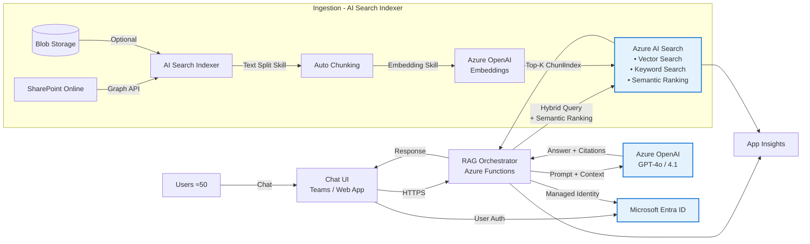

# MVP System Architecture — RAG Chatbot (Azure AI Search)

Below is the **MVP architecture** that is fully Azure-native, easy to set up, and enterprise-ready.

## Complete Architecture (Teams + Conversation Memory)

```mermaid
flowchart TB
    subgraph Users["👥 Users"]
        U[~50 Employees]
    end

    subgraph Teams["💬 Microsoft Teams"]
        T[Teams Chat UI]
    end

    subgraph BotService["🤖 Azure Bot Service (FREE)"]
        BS[Bot Framework<br/>• Routes messages<br/>• Teams channel<br/>• Auth handling]
    end

    subgraph Functions["⚡ Azure Functions (Modular)"]
        direction TB
        M1[📨 Module 1<br/>bot_handler.py]
        M2[💾 Module 2<br/>chat_history.py]
        M3[🔄 Module 3<br/>query_processor.py]
        M4[🔍 Module 4<br/>search_client.py]
        M5[🧠 Module 5<br/>openai_client.py]
        M6[📎 Module 6<br/>citations.py]
        
        M1 --> M2
        M2 --> M3
        M3 --> M4
        M4 --> M5
        M5 --> M6
        M6 --> M2
    end

    subgraph AI["🤖 Azure AI Services"]
        AIS[Azure AI Search<br/>• Hybrid search<br/>• Semantic ranking<br/>• Vector index]
        AOAI[Azure OpenAI<br/>• GPT-5-mini (chat)<br/>• text-embedding-3-large]
    end

    subgraph Memory["💭 Conversation Memory"]
        COSMOS[(Cosmos DB<br/>• Chat history<br/>• 7-day TTL<br/>• Per-user sessions)]
        REDIS[(Redis Cache<br/>• Optional<br/>• Frequent Q&A)]
    end

    subgraph Ingestion["📥 Document Ingestion"]
        SP[SharePoint Online]
        IDX[AI Search Indexer<br/>• Auto chunking<br/>• Auto embedding]
    end

    subgraph Security["🔐 Security"]
        ENTRA[Entra ID / SSO]
        KV[Key Vault]
    end

    U -->|Chat| T
    T -->|Bot Protocol| BS
    BS -->|HTTPS| M1
    M2 <-->|Read/Write| COSMOS
    M2 <-.->|Cache| REDIS
    M4 -->|Hybrid Query| AIS
    M4 -->|Embed Query| AOAI
    M5 -->|Generate| AOAI
    SP -->|Graph API| IDX
    IDX -->|Index| AIS
    M1 -.->|Auth| ENTRA
    M1 -.->|Secrets| KV

    classDef free fill:#C8E6C9,stroke:#2E7D32
    classDef managed fill:#E3F2FD,stroke:#1976D2
    classDef memory fill:#F3E5F5,stroke:#7B1FA2
    
    class BS free
    class AIS,AOAI,COSMOS managed
    class M1,M2,M3,M4,M5,M6 memory
```

## Modular Design (Easy to Debug!)

Each module is **independent** and can be fixed without breaking others:

| Module | File | Responsibility | Can Fail? |
|--------|------|----------------|-----------|
| 1 | `bot_handler.py` | Teams message handling | ❌ Critical |
| 2 | `chat_history.py` | Conversation memory | ✅ Fallback to no memory |
| 3 | `query_processor.py` | Query rewriting | ✅ Fallback to original query |
| 4 | `search_client.py` | Hybrid search | ❌ Critical |
| 5 | `openai_client.py` | LLM generation | ❌ Critical |
| 6 | `citations.py` | Source extraction | ✅ Answer still works |

## Why Azure AI Search (vs. Weaviate)

| Consideration | Weaviate | Azure AI Search | Winner |
|---------------|----------|-----------------|--------|
| **Setup Effort** | Container Apps, volumes, networking | Portal wizard, fully managed | ✅ AI Search |
| **Hybrid Search** | Manual RRF implementation | Built-in | ✅ AI Search |
| **Reranking** | Custom cross-encoder needed | Semantic Ranking included | ✅ AI Search |
| **Chunking** | Custom code required | Integrated Text Split skill | ✅ AI Search |
| **Vectorization** | Custom embedding pipeline | Integrated Azure OpenAI skill | ✅ AI Search |
| **SharePoint Integration** | Custom Graph API code | Native indexer support | ✅ AI Search |
| **Developer Repeatability** | Complex setup docs | ARM/Bicep templates, portal | ✅ AI Search |
| **Enterprise Support** | Community | Microsoft SLA | ✅ AI Search |
| **Cost (Basic)** | ~$50-100/mo | ~$75/mo | Comparable |

## Architecture Diagram



## Component Responsibilities

### 1) Chat UI (Teams/Web)
* Collects user messages
* Displays answer + citations
* Authenticates users via Entra ID

### 2) RAG Orchestrator (Azure Functions)
* Receives user query
* Calls Azure AI Search with hybrid query
* Constructs prompt with retrieved chunks
* Calls Azure OpenAI for answer generation
* Returns response with citations

### 3) Azure AI Search (The Key Simplification!)
* **Integrated Vectorization** - automatically chunks and embeds documents
* **Hybrid Search** - combines vector + keyword search in single query
* **Semantic Ranking** - AI-powered reranking for better precision
* **SharePoint Indexer** - native connector via Graph API
* No infrastructure to manage!

### 4) Azure OpenAI
* **Embeddings** (text-embedding-3-large) - via AI Search skill
* **Chat Completion** (GPT-5-mini / GPT-5) - for answer generation

### 5) Ingestion Pipeline (Built into AI Search!)
* **Data Sources**: SharePoint, Blob Storage, OneLake, etc.
* **Skillset**: Text Split + Azure OpenAI Embedding skills
* **Indexer**: Runs on schedule, handles incremental updates
* **No custom code required!**

## MVP Setup Steps (6 weeks)

### Week 1-2: Infrastructure
```bash
# 1. Create Azure AI Search (Basic tier)
az search service create --name rag-search --resource-group rg-rag \
  --sku basic --location eastus

# 2. Create Azure OpenAI with deployments
az cognitiveservices account create --name rag-openai --resource-group rg-rag \
  --kind OpenAI --sku S0 --location eastus

# 3. Deploy GPT-4o and embedding models
az cognitiveservices account deployment create --name rag-openai \
  --resource-group rg-rag --deployment-name gpt-4o --model-name gpt-4o

az cognitiveservices account deployment create --name rag-openai \
  --resource-group rg-rag --deployment-name embeddings \
  --model-name text-embedding-3-large
```

### Week 3-4: Ingestion Setup
1. Go to Azure Portal → AI Search → "Import and vectorize data"
2. Select data source (Blob Storage or SharePoint)
3. Configure chunking (Text Split skill)
4. Configure vectorization (Azure OpenAI embedding)
5. Run indexer

### Week 5: RAG Orchestrator
```python
# Simple RAG function with Azure AI Search
from azure.search.documents import SearchClient
from openai import AzureOpenAI

async def rag_query(user_question: str) -> dict:
    # 1. Hybrid search with semantic ranking
    results = search_client.search(
        search_text=user_question,
        vector_queries=[VectorizedQuery(
            vector=embed(user_question),
            fields="contentVector",
            k_nearest_neighbors=5
        )],
        query_type="semantic",
        semantic_configuration_name="default",
        top=5
    )
    
    # 2. Build context from results
    context = "\n\n".join([
        f"[{i+1}] {r['title']}\n{r['content']}" 
        for i, r in enumerate(results)
    ])
    
    # 3. Generate answer with citations
    response = openai_client.chat.completions.create(
        model="gpt-4o",
        messages=[
            {"role": "system", "content": SYSTEM_PROMPT},
            {"role": "user", "content": f"Context:\n{context}\n\nQuestion: {user_question}"}
        ]
    )
    
    return {
        "answer": response.choices[0].message.content,
        "sources": [{"title": r["title"], "url": r["sourceUrl"]} for r in results]
    }
```

### Week 6: Testing & Evaluation
* Create 50 test Q&A pairs
* Run evaluation (precision, recall, faithfulness)
* Tune semantic ranking configuration

## Cost Estimate (Monthly)

| Resource | SKU | Cost |
|----------|-----|------|
| Azure AI Search | Basic | $75 |
| Azure OpenAI (GPT-5-mini) | Standard | $25-35 |
| Azure OpenAI (Embeddings) | Standard | $3-5 |
| Azure Functions | Consumption | $10-30 |
| Azure Cosmos DB | Serverless | $5-20 |
| Azure Bot Service | Free F0 | $0 |
| App Insights | Pay-as-you-go | $10-20 |
| **Total** | | **$130-185/mo** |

> 💡 **Why so cheap?** GPT-5-mini is ~10x cheaper than GPT-4o with similar quality!

## Scaling Path (Post-MVP)

| When | Action |
|------|--------|
| **More documents** | Upgrade AI Search to Standard S1 |
| **More users** | Add AI Search replicas |
| **Lower latency** | Add Redis cache for common queries |
| **Higher throughput** | Increase Azure OpenAI TPM quota |
| **Private networking** | Add VNet + Private Endpoints |

## Key Benefits for Stakeholders

| Stakeholder | Benefit |
|-------------|---------|
| **Executives** | Lower risk, Azure-native, Microsoft support |
| **Program Managers** | Faster delivery (6 vs 8 weeks), fewer dependencies |
| **Developers** | No Container infrastructure, familiar Azure APIs |
| **DevOps** | Managed service, no patching, built-in monitoring |
| **Junior Devs** | Well-documented, portal wizard, ARM templates |
